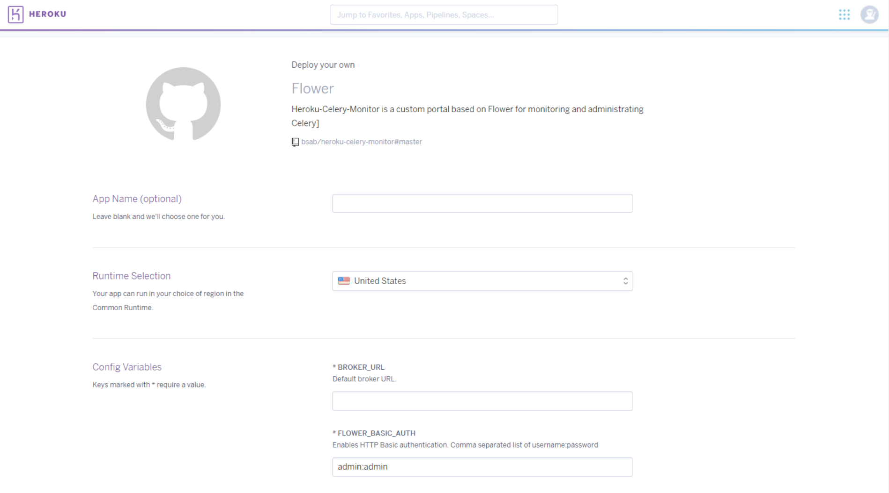

Heroku-Celery-Monitor  
=========

**Heroku-Celery-Monitor** is a custom portal based on [Flower](https://github.com/mher/flower/) for monitoring and administrating [Celery](http://www.celeryproject.org/) clusters 
using [Heroku](https://devcenter.heroku.com/articles/free-dyno-hours) (free Dyno).

It is a powerful reusable app for interacting with the Celery clusters.

Quick start
-----------
Click on deploy button and set the correct BROKER_URL and the FLOWER_BASIC_AUTH.

## Author

[Sabatino Severino](https://about.me/the_sab), @bsab

## License

Django-Fieldbook-Demo is available under the MIT license. See the LICENSE file for more info.

Notes
------

Feel free to fork and send a pull request.
